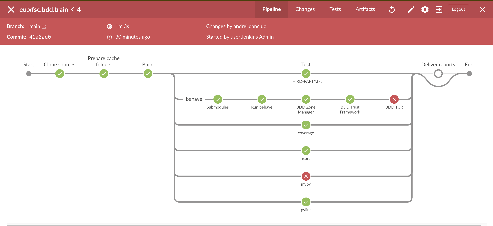
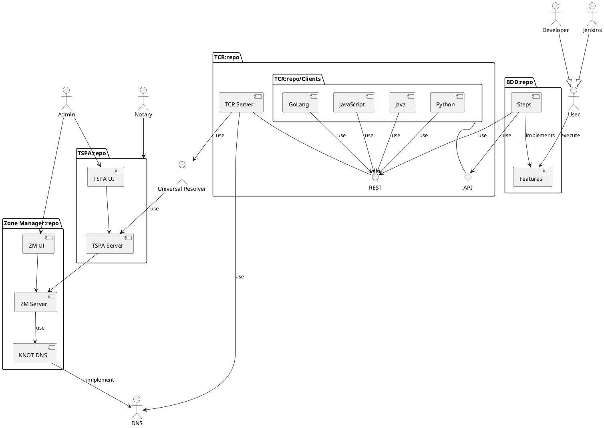

# TRAIN Behavior-Driven Development (BDD) Framework

Based on the XFSC Python-based BDD lib [eu.xfsc.bdd.core]

# Description

CI Automation (Setup, Run and Reports) is set up with Jenkins.
Here's the pipeline visualization from the [Jenkinsfile](Jenkinsfile) `TRAIN` pipeline:



The components' relationship is drawn in Plant UML syntax below.



# Getting started

BDD TRAIN depends on multiple components, all of which are shown above in the PlantUML diagram.
To simplify the 'Get Started' procedure, we provide docker-compose setup (see [compose.yml](deployment/docker/compose.yml)).

## env.sh

Since the Framework is configured through OS environments, you have to prepare your [env.sh](env.sample.sh).

```bash
# Duplicate sample file
cp env.sample.sh env.sh

# Configure file
vim env.sh

./env.sh
```

``env.sh`` will be mounted and used later into the Docker ``eu-xfsc-bdd-train`` container.

## List Images Command

Let's assume that we have pulled or built the TRAIN BDD image, and we have:

```bash
docker-compose images
CONTAINER               REPOSITORY                                               TAG                 IMAGE ID            SIZE
eu-xfsc-bdd-train       node-654e3bca7fbeeed18f81d7c7.ps-xaas.io/train/bdd       latest-local        d96e0de86436        2.66GB
eu-xfsc-bdd-train-dev   node-654e3bca7fbeeed18f81d7c7.ps-xaas.io/train/bdd-dev   latest-local        cea001178f41        2.84GB
```
If not, then [build](deployment/docker/README.md#build) or [pull](deployment/docker/README.md#pull) the image.

## Open a bash session within ``eu-xfsc-bdd-train`` just container.

```bash
docker-compose run --rm eu-xfsc-bdd-train bash
```

## Activate ``env.sh``
In the opened session, activate our prepared ``env.sh``

```bash
cd eu.xfsc.bdd.train/
source env.sh
```

## Behave

Finally !, run the BDD tests in the opened session.
```
behave
```

## Screencast

The demo is recorded as an Asciinema screencast
[](https://asciinema.org/a/6YkQ5mi2G4KKzDLoNe8KfzTyU)


## Advanced Setup and Run

A more complex setup is described here in [advance.setup.and.run.md](docs/advance.setup.and.run.md).


## License

Apache License Version 2.0 (see [LICENSE](LICENSE)).

----------------------------------------------------------------------------------------
[eu.xfsc.bdd.core]: https://gitlab.eclipse.org/eclipse/xfsc/dev-ops/testing/bdd-executor
